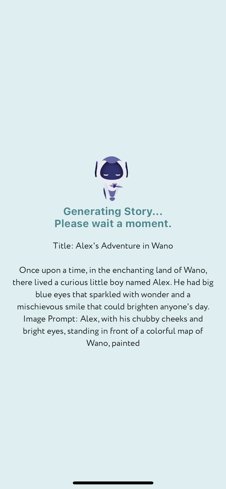

# Unique Bedtime Chronicles

Introducing **Unique Bedtime Chronicles** the groundbreaking mobile application poised to transform the way you connect with your child during those treasured bedtime moments. Our cutting-edge app redefines the art of bedtime storytelling by empowering you to craft enchanting bedtime tales meticulously tailored to your child's distinct interests and preferences. With **Unique Bedtime Chronicles** you'll forge a profound, lasting bond with your child while kindling their imagination like never before.

## Feature graphic


## Screenshots

|   |   |   |
|---|---|---|
||||
||||

https://github.com/olololoe110399/bedtime_stories/assets/58255731/28ebb23b-486f-48f2-8ca7-724a9397d008

## Table of Contents

- [Features](#features)
- [Project Structure](#project-structure)
- [Libraries Used](#libraries-used)
- [Installation](#installation)
- [Usage](#usage)
- [Contributing](#contributing)
- [License](#license)

## Features

- Craft bespoke and personalized bedtime stories for your child.
- Elevate your child to the role of the central character in their unique adventure.
- Seamlessly introduce characters your child holds dear.
- Safeguard your child's treasured stories for future enjoyment.

## Project Structure

```YML
.
├── app_icon
│   ├── app-icon.yaml
│   └── app_icon.png
├── assets
│   ├── font
│   ├── img
│   └── json
├── bricks
│   └── feature_template
├── bricks_configs
│   └── feature.json
├── lib
│   ├── core
│   │   ├── src
│   │   │   ├── base
│   │   │   │   ├── base.dart
│   │   │   │   ├── base_event.dart
│   │   │   │   ├── base_page_state.dart
│   │   │   │   ├── base_state.dart
│   │   │   │   ├── base_vm.dart
│   │   │   │   ├── base_vm_mixin.dart
│   │   │   │   ├── wrap_state.dart
│   │   │   │   └── wrap_state.freezed.dart
│   │   │   ├── common
│   │   │   │   ├── common.dart
│   │   │   │   ├── common_event.dart
│   │   │   │   ├── common_event.freezed.dart
│   │   │   │   ├── common_state.dart
│   │   │   │   ├── common_state.freezed.dart
│   │   │   │   └── common_vm.dart
│   │   │   ├── config
│   │   │   │   ├── app_config.dart
│   │   │   │   ├── config.dart
│   │   │   │   ├── env.dart
│   │   │   │   └── env.g.dart
│   │   │   ├── constants
│   │   │   │   ├── constants.dart
│   │   │   │   ├── date_time_format_constants.dart
│   │   │   │   ├── device_constants.dart
│   │   │   │   ├── locale_constants.dart
│   │   │   │   ├── log_constants.dart
│   │   │   │   └── ui_constants.dart
│   │   │   ├── dimen
│   │   │   │   ├── app_dimen.dart
│   │   │   │   ├── dimen.dart
│   │   │   │   └── dimens.dart
│   │   │   ├── errors
│   │   │   │   ├── app_error.dart
│   │   │   │   ├── app_error_listener.dart
│   │   │   │   ├── app_error_listener_mixin.dart
│   │   │   │   ├── app_error_mapper.dart
│   │   │   │   ├── app_exception_wrapper.dart
│   │   │   │   ├── app_handle_exception.dart
│   │   │   │   ├── errors.dart
│   │   │   │   └── exceptions.dart
│   │   │   ├── extension
│   │   │   │   ├── extension.dart
│   │   │   │   └── string_extension.dart
│   │   │   ├── hive
│   │   │   │   ├── hive.dart
│   │   │   │   ├── hive_database_manager.dart
│   │   │   │   ├── hive_encryption.dart
│   │   │   │   ├── hive_model.dart
│   │   │   │   ├── hive_model_mixin.dart
│   │   │   │   ├── hive_operation.dart
│   │   │   │   ├── hive_types.dart
│   │   │   │   ├── primitive_database.dart
│   │   │   │   ├── primitive_keys.dart
│   │   │   │   └── secure_database_manager.dart
│   │   │   ├── mixins
│   │   │   │   ├── log_mixin.dart
│   │   │   │   └── mixins.dart
│   │   │   ├── model
│   │   │   │   ├── model.dart
│   │   │   ├── navigation
│   │   │   │   ├── app_navigator.dart
│   │   │   │   ├── app_routes.dart
│   │   │   │   ├── app_routes.gr.dart
│   │   │   │   └── navigation.dart
│   │   │   ├── network
│   │   │   │   ├── base
│   │   │   │   │   ├── base.dart
│   │   │   │   │   ├── dio_builder.dart
│   │   │   │   │   └── network_constants.dart
│   │   │   │   ├── middleware
│   │   │   │   │   ├── access_token_interceptor.dart
│   │   │   │   │   ├── base_interceptor.dart
│   │   │   │   │   ├── custom_log_interceptor.dart
│   │   │   │   │   ├── header_interceptor.dart
│   │   │   │   │   ├── middleware.dart
│   │   │   │   │   ├── network_info.dart
│   │   │   │   │   ├── refresh_token_api_service.dart
│   │   │   │   │   └── refresh_token_interceptor.dart
│   │   │   │   ├── network.dart
│   │   │   │   ├── rest_client.dart
│   │   │   │   ├── rest_client.g.dart
│   │   │   │   ├── rest_non_auth_client.dart
│   │   │   │   └── rest_non_auth_client.g.dart
│   │   │   ├── observer
│   │   │   │   └── observer.dart
│   │   │   ├── preference
│   │   │   │   ├── preference.dart
│   │   │   ├── stream
│   │   │   │   └── stream.dart
│   │   │   ├── theme
│   │   │   │   └── theme.dart
│   │   │   ├── usecases
│   │   │   │   └── usecases.dart
│   │   │   ├── utils
│   │   │   │   ├── utils.dart
│   │   │   └── widgets
│   │   │       └── widgets.dart
│   │   └── core.dart
│   ├── data
│   │   ├── src
│   │   │   ├── data_sources
│   │   │   │   ├── data_sources.dart
│   │   │   ├── mapper
│   │   │   │   ├── mapper.dart
│   │   │   ├── models
│   │   │   │   ├── models.dart
│   │   │   └── repositories
│   │   │       └── repositories.dart
│   │   └── data.dart
│   ├── di
│   │   ├── di.config.dart
│   │   └── di.dart
│   ├── domain
│   │   ├── src
│   │   │   ├── entities
│   │   │   │   ├── entities.dart
│   │   │   ├── repositories
│   │   │   │   └── repositories.dart
│   │   │   └── usecases
│   │   │       └── usecases.dart
│   │   └── domain.dart
│   ├── presentation
│   │   ├── src
│   │   │   ├── define_story
│   │   │   │   ├── define_story.dart
│   │   │   │   ├── define_story_event.dart
│   │   │   │   ├── define_story_page.dart
│   │   │   │   ├── define_story_state.dart
│   │   │   │   └── define_story_vm.dart
│   │   │   └── app.dart
│   │   └── presentation.dart
│   ├── resources
│   │   ├── generated
│   │   │   ├── intl
│   │   │   │   ├── messages_all.dart
│   │   │   │   ├── messages_en.dart
│   │   │   │   └── messages_vi.dart
│   │   │   └── l10n.dart
│   │   ├── src
│   │   │   ├── generated
│   │   │   │   ├── intl
│   │   │   │   │   ├── messages_all.dart
│   │   │   │   │   ├── messages_en.dart
│   │   │   │   │   └── messages_vi.dart
│   │   │   │   └── l10n.dart
│   │   │   └── l10n
│   │   │       ├── intl_en.arb
│   │   │       └── intl_vi.arb
│   │   └── resources.dart
│   └── main.dart
├── splash
│   ├── ic_splash.png
│   └── splash.yaml
├── test
│   └── widget_test.dart
├── Makefile
├── analysis_options.yaml
├── mason-lock.json
├── mason.yaml
└── pubspec.yaml

```

## Libraries Used

- [retrofit](https://pub.dev/packages/retrofit): A type-safe HTTP client for Dart using the Retrofit package.
- [freezed](https://pub.dev/packages/freezed): A code generator for unions/pattern-matching/copy.
- [dartz](https://pub.dev/packages/dartz): Functional programming in Dart.
- [lottie](https://pub.dev/packages/lottie): A library for using Lottie animations in Flutter.
- [hooks_riverpod](https://pub.dev/packages/hooks_riverpod): A simple way to manage state in your Flutter applications.
- [mockito](https://pub.dev/packages/mockito): Mock library for Dart.
- [hive](https://pub.dev/packages/hive): Hive is a lightweight and blazing fast key-value database written in pure Dart.
- [get_it](https://pub.dev/packages/get_it): This is a simple Service Locator for Dart and Flutter projects with some additional goodies highly inspired by Splat
- [share_plus](https://pub.dev/packages/share_plus): A Flutter plugin to share content from your Flutter app via the platform's share dialog.
- [flutter_tts](https://pub.dev/packages/flutter_tts): A flutter text to speech plugin (Swift,Kotlin)
- ...

## Installation

1 Getting Started:

Make sure you have Flutter and Dart installed on your machine. You can install them by following the instructions in the [official Flutter documentation](https://flutter.dev/docs/get-started/install).

```bash
Flutter 3.13.9 • channel stable
Framework • revision d211f42860 (3 months ago) • 2023-10-25 13:42:25 -0700
Engine • revision 0545f8705d
Tools • Dart 3.1.5 • DevTools 2.25.0
```

COCOAPODS: 1.14.3

2 Clone this repository:

```bash
git clone https://github.com/olololoe110399/bedtime_stories.git
```

3 Navigate to the project directory:

```bash
cd bedtime_stories
```

4 create env and config:

```bash
cp .env.example .env
```

```.env
OPEN_AI_API_KEY=<REPLACE WITH YOUR API KEY>
```

5 Install dependencies and generate files:

```bash
make sync
```

## Usage

Run the app on a simulator or device:

```bash
flutter run
```

The app should start and you can explore the Valorant agents.

## Contributing

Contributions are welcome! If you find any bugs or want to add new features, feel free to open an issue or submit a pull request. For major changes, please open an issue first to discuss what you would like to change.

Please make sure to update tests as needed.

## License

This project is licensed under the [MIT License](LICENSE).
